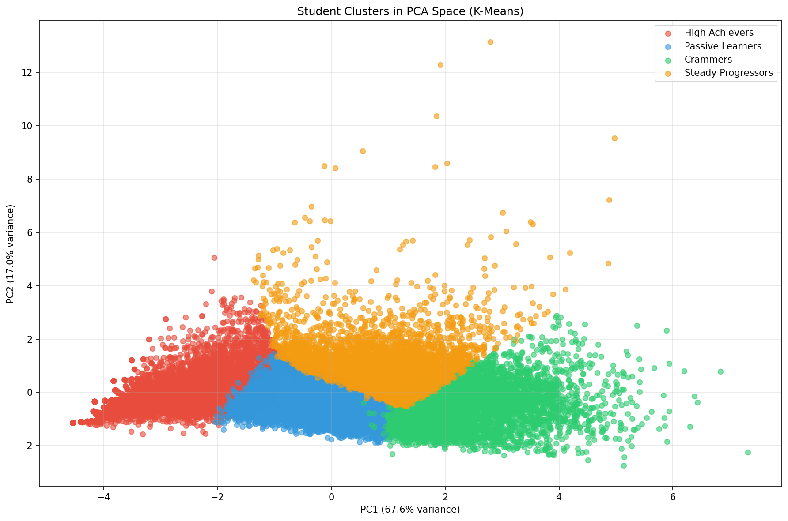
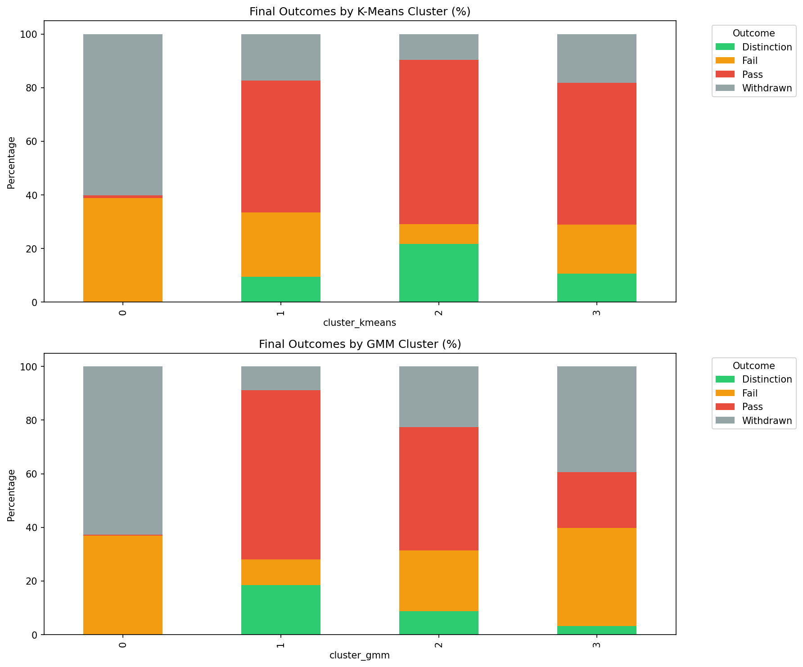
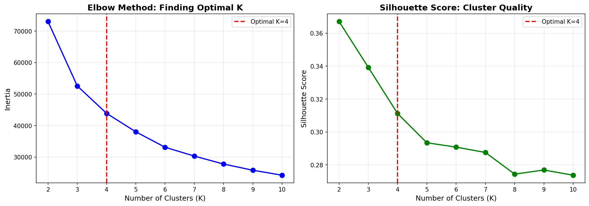
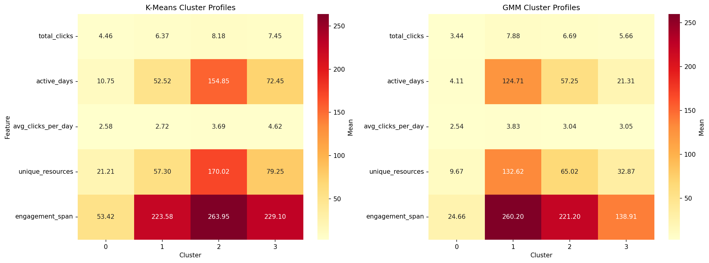
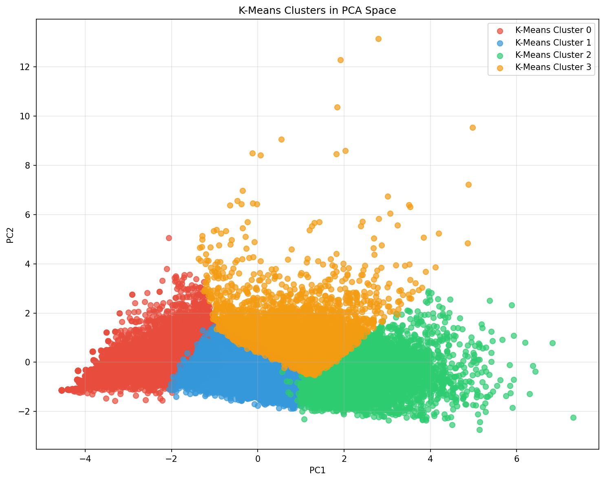
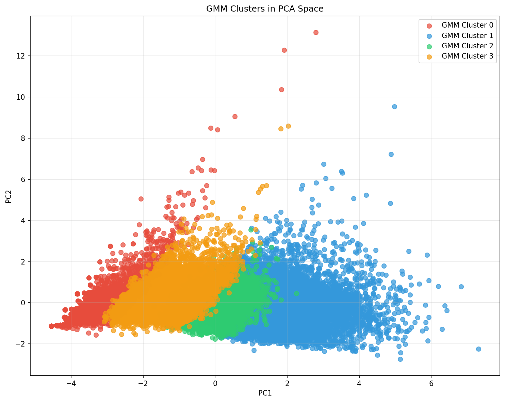
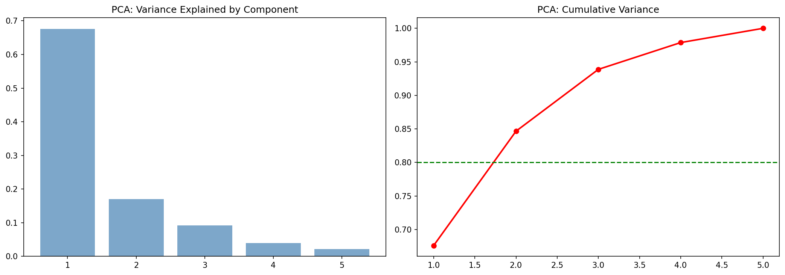
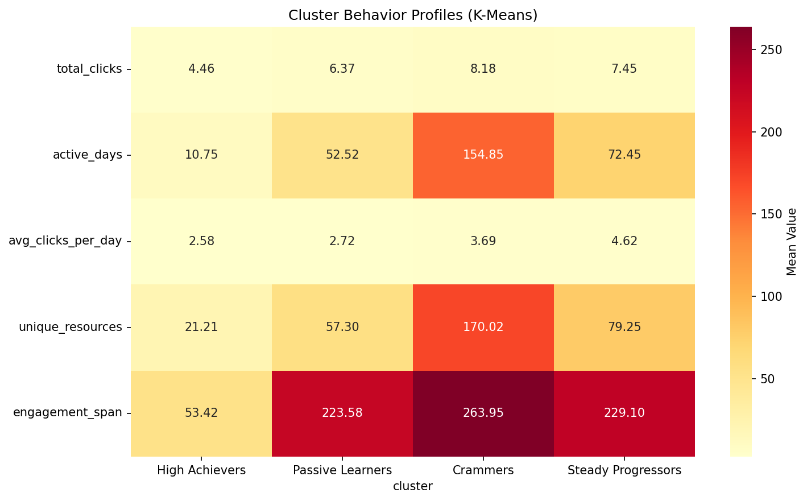
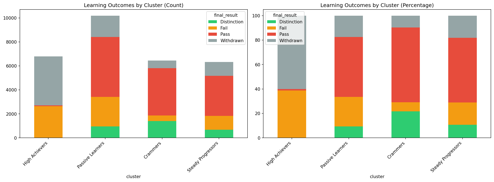

<div align="center">

# Student Learning Behaviour Clustering

**Finding learner archetypes in 10 million VLE clicks — without ever showing the model a grade.**

[](https://www.python.org/)
[](https://scikit-learn.org/)
[](https://pandas.pydata.org/)
[](https://analyse.kmi.open.ac.uk/open-dataset)
[]()

</div>



---

## The result in one chart

Clustering is done on **behaviour only** — clicks, active days, breadth of resources, engagement span. Final grades are never part of the feature matrix. They are attached *afterwards*, purely to ask: did the behavioural groups turn out to mean anything?

They did.



| K-Means cluster | Behaviour | Distinction | Pass | Fail | Withdrawn |
|---|---|---|---|---|---|
| **0** | Barely engaged — 11 active days | ~0% | ~1% | ~38% | **~60%** |
| **1** | Moderate, spread thin | ~9% | ~49% | ~24% | ~18% |
| **2** | Deeply engaged — 155 active days | **~22%** | ~61% | ~8% | ~10% |
| **3** | Intense but shorter | ~11% | ~53% | ~18% | ~18% |

A model that never saw a single grade separated the cohort into one group that withdraws **60%** of the time and another that earns distinctions **22%** of the time. That separation is the whole point: these signals exist in the LMS *while the module is still running*, long before a final result is recorded.

---

## Dataset

**[Open University Learning Analytics Dataset (OULAD)](https://analyse.kmi.open.ac.uk/open-dataset)** — anonymised data on 32,593 students across 7 course modules, including ~10.6M rows of daily VLE interaction.

> Kuzilek, J., Hlosta, M., & Zdrahal, Z. (2017). *Open University Learning Analytics dataset.*
> **Scientific Data**, 4, 170171. https://doi.org/10.1038/sdata.2017.171
> Released under **CC BY 4.0**.

### Files this project needs

| File | Role | In this repo? |
|---|---|---|
| `studentVle.csv` | Daily click counts per student per resource — the entire feature source | ❌ ~432 MB, download it |
| `studentInfo.csv` | Demographics and `final_result` — used **post hoc only** | ❌ download it |
| `vle.csv` | Resource metadata (`activity_type`, module, presentation) | ✅ committed, 254 KB |

Download the archive from the [OULAD page](https://analyse.kmi.open.ac.uk/open-dataset), unzip, and drop `studentVle.csv` and `studentInfo.csv` in the project root. The scripts read them by relative filename.

---

## Feature engineering

Five behavioural features, aggregated per `id_student` from the raw clickstream:

| Feature | Definition | Captures |
|---|---|---|
| `total_clicks` | `log1p(sum(sum_click))` | Overall volume — log-scaled, because raw click counts are severely right-skewed |
| `active_days` | `nunique(date)` | Consistency: how many distinct days the student showed up |
| `avg_clicks_per_day` | `mean(sum_click)` | Intensity per session |
| `unique_resources` | `nunique(id_site)` | Breadth — how much of the course material was touched |
| `engagement_span` | `max(date) - min(date)` | Persistence: first interaction to last |

Students with zero clicks are dropped, then all five features are `StandardScaler`-normalised before clustering.

The design choice that matters: **`final_result` is never in `X`.** It is merged in only after cluster labels are assigned, so the outcome table above is a genuine validation rather than a restatement of the input.

---

## Choosing K



| K | Silhouette |
|---|---|
| 2 | 0.367 |
| 3 | 0.339 |
| **4** | **0.311** |
| 5 | 0.293 |
| 6+ | < 0.291 |

Silhouette technically peaks at **K = 2**, and it is worth being straight about that: K = 4 is a deliberate trade of ~0.056 silhouette for interpretability. K = 2 splits the cohort into "engaged" and "not engaged", which is statistically cleaner and pedagogically useless. K = 4 is where the elbow flattens *and* where the clusters start describing distinguishable study patterns a tutor could act on differently.

---

## Cluster profiles



**K-Means** (feature means per cluster):

| Cluster | total_clicks (log) | active_days | avg_clicks/day | unique_resources | engagement_span | Archetype |
|---|---|---|---|---|---|---|
| 0 | 4.46 | 10.75 | 2.58 | 21.21 | 53.42 | **Early dropout** |
| 1 | 6.37 | 52.52 | 2.72 | 57.30 | 223.58 | **Steady but light** |
| 2 | 8.18 | 154.85 | 3.69 | 170.02 | 263.95 | **High achiever** |
| 3 | 7.45 | 72.45 | 4.62 | 79.25 | 229.10 | **Intense burst / crammer** |

Note cluster 3: the *highest* clicks-per-day of any group (4.62) but roughly half the active days of cluster 2. High intensity, low consistency — the signature of cramming, and it maps to a materially worse outcome distribution than cluster 2.

**GMM** finds a similar structure with softer boundaries, and isolates a more extreme disengaged group (cluster 0: 4.11 active days, 24.66 day span).

---

## K-Means vs GMM

| | K-Means | Gaussian Mixture |
|---|---|---|
| Assignment | Hard | Probabilistic (soft) |
| Cluster shape | Spherical, equal variance | Full covariance — elliptical, unequal |
| Best at | Clean, actionable segments | Students who genuinely sit between archetypes |

<table>
<tr>
<td width="50%"></td>
<td width="50%"></td>
</tr>
<tr><td align="center"><em>K-Means</em></td><td align="center"><em>GMM</em></td></tr>
</table>

GMM is the better description of reality — engagement is a continuum, not four boxes — but K-Means gives the cleaner intervention rule. Both are reported rather than one being declared the winner.

---

## Running it

```bash
pip install pandas numpy scikit-learn matplotlib seaborn
```

Place `studentVle.csv` and `studentInfo.csv` in the project root, then:

```bash
python 1_run_clustering_analysis.py   # clustering, silhouettes, cluster summaries
python 2_generate_dashboard.py        # standalone HTML dashboard with charts inlined as base64
```

Open `clustering_comparison_dashboard.html` in any browser — it is fully self-contained, no server needed.

### Script inventory

This repo grew through iteration and kept its history. For a clean run, use the two numbered scripts above.

| Script | What it is |
|---|---|
| `1_run_clustering_analysis.py` | **Canonical** — K-Means + GMM, silhouette, PCA, post-hoc outcomes |
| `2_generate_dashboard.py` | **Canonical** — regenerates the self-contained HTML dashboard |
| `main.py` | Earlier K-Means-only version with an interactive `plt.show()` |
| `GMM.py` | GMM experiment in isolation |
| `app.py`, `app2.py`, `app3.py` | Successive drafts of the full analysis + figure export |
| `main_backup.py`, `generateDashboard.py` | Superseded |

---

## Figure gallery

| | |
|---|---|
|  |  |
| *Explained variance across principal components* | *Single-model cluster profile heatmap* |
|  |  |
| *Outcome distribution per cluster* | *K-Means vs GMM profiles* |

---

## Limitations

Worth stating plainly, because unsupervised results invite over-reading:

- **Clusters are descriptive, not causal.** Low engagement correlates with withdrawal; it does not follow that forcing clicks would prevent it. Both plausibly share upstream causes the dataset does not contain.
- **`engagement_span` partly encodes the outcome.** A student who withdraws in week 3 mechanically has a short span. Some of cluster 0's withdrawal rate is that artefact rather than a discovery.
- **Aggregating the whole presentation discards time.** A student who collapses in week 20 and one who never started can land near each other. Windowed features would separate them, and would be the natural next step toward an actual early-warning system.
- **K = 4 is a judgement call**, not what silhouette alone would pick — see above.
- **Single institution, 2013–2014 presentations.** OULAD is one university's VLE; the archetypes should not be assumed to transfer without re-fitting.
